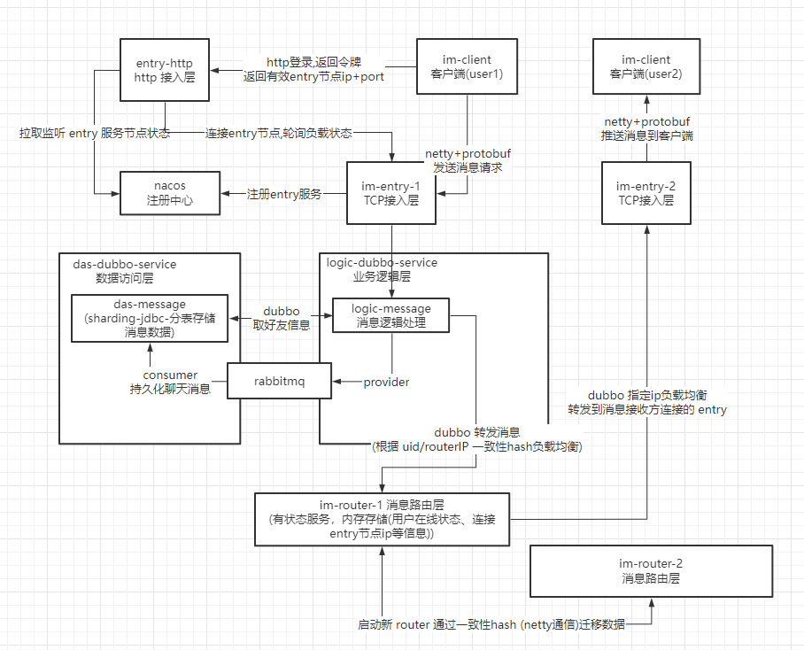

## 基本介绍

`so-im` 是一款简单的可水平扩展的 `IM(即时通讯)`系统。

客户端和TCP接入层通过 netty+protobuf 通信。

后端服务通过 dubbo 服务间调用。

## 功能演示

好友、群、单聊、群聊、内置命令

<video id="video" controls="" preload="none" poster="doc/image/README/soim.jpg">
      <source id="mp4" src="doc/image/README/soim.mp4" type="video/mp4">
</videos>

## 消息转发流程

## 内置命令

| 命令    | 选项                                                         | 描述                                                 |
| ------- | ------------------------------------------------------------ | ---------------------------------------------------- |
| login   | -u 账号 -p 密码                                         | 登录并连接tcp接入层                                  |
| send    | -u 好友id 单聊消息 -g 群id 群消息                       | 发送消息                                             |
| users   |                                                              | 在线用户列表                                         |
| friends |                                                              | 我的好友列表                                         |
| group   |                                                              | 查询我的群聊列表                                     |
| group   | create 群聊名称 search 群聊名称(右模糊) join 群聊id users | 创建群聊 搜索群聊 加入群聊 群用户列表 |
| search  | -u 用户账号(右模糊)                                          | 搜索用户                                             |
| add     | -u 用户id                                                    | 添加好友                                             |
| me      |                                                              | 我的信息                                             |
| exit    |                                                              | 退出客户端                                           |

## TODO LIST

- [x] 好友、基础单聊
- [x] 群搜索、添加、列表、基础群聊
- [x] 消息通过MQ持久化到MySQL分表库
- [x] 启动路由层新节点根据一致性hash迁移其他节点内存数据
- [x] 接入层负载均衡
- [x] 分布式分段id生成服务
- [ ] 聊天记录查询
- [ ] 优化命令行客户端打印输出
- [ ] 群聊,单聊 消息已读确认
- [ ] 未读离线消息推送
- [ ] 客户端接入层消息加密
- [ ] dubbo service SSL 加密
- [ ] 路由层状态服务冗余节点备份，自动切换
- [ ] 接入prometheus对服务进行监控
- [ ] 服务压测

## 启动步骤

### 创建数据库

### 中间件配置

配置 nacos、mysql、rabbitmq、redis 服务地址

### 启动如下服务

